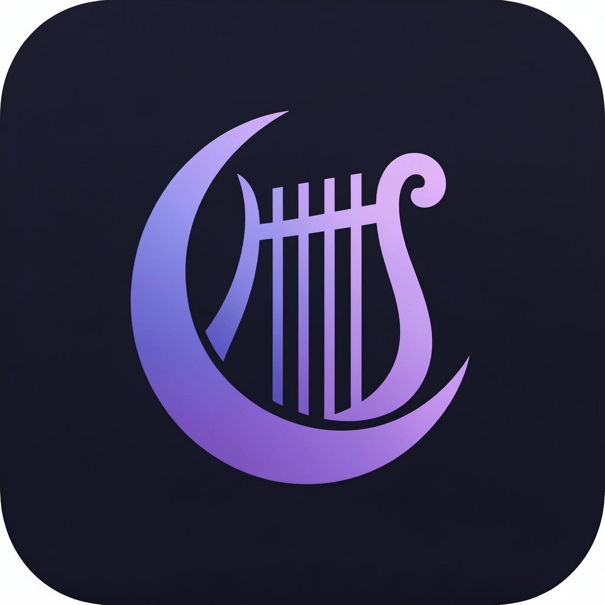

# Lyris Tracker

<p align="center">
  
</p>

> **⚠️ EXPERIMENTAL — 100% AI-DEVELOPED**
> This project was built entirely by AI agents. It is experimental software that may contain bugs, security vulnerabilities, and untested edge cases. Use at your own risk. Do not rely on it for medical decisions or as your sole tracking method.

**100% offline period & cycle tracker** — no cloud, no accounts, no data leaves your phone.

Built with Flutter. Inspired by [Clue](https://helloclue.com/)'s prediction methodology.

## ✨ Features
- **Partner Mode** — Share read-only cycle status via QR pairing + WiFi auto-sync (local network only, no internet)
- **Privacy First** — All data stored locally in SQLite. Nothing is ever uploaded.
- **Cycle Tracking** — Log periods with flow level, track 30+ symptoms across 6 categories
- **Science-Based Predictions** — Algorithm modeled on Clue's published methodology:
  - Last 12 cycles for predictions, last 6 for averages
  - Ovulation = predicted next period − 13 days
  - Bayesian-inspired recency weighting (Urteaga et al., 2021)
  - Outlier rejection for biologically implausible cycles (15–60 day range)
  - Confidence scoring based on data amount + cycle consistency

## 📱 Screenshots

*(coming soon)*

## 🧪 Prediction Algorithm

The prediction engine (`lib/services/prediction_engine.dart`) implements:

| Parameter | Method |
|-----------|--------|
| Cycle length prediction | Recency-weighted average of last 12 completed cycles |
| Period length prediction | Recency-weighted average of last 12 cycles |
| Averages displayed to user | Simple mean of last 6 cycles (matches Clue) |
| Ovulation day | Next predicted period start − 13 days |
| Fertile window | Ovulation − 5 days through ovulation + 1 day |
| PMS window | Predicted period start − 7 days |
| Outlier handling | Cycles outside 15–60 days are excluded |
| Confidence | Weighted: 40% data quantity + 60% cycle consistency (CV) |

## 🏗️ Architecture

```
lib/
├── data/           # Drift database schema & DAOs
├── models/         # CycleData, CyclePrediction, SymptomCatalog
├── providers/      # Riverpod state management
├── screens/        # UI screens (Home, Calendar, Settings, Partner)
├── services/       # PredictionEngine, SyncServer, SyncClient, LyrisCrypto
└── theme/          # Lyris design system (warm rosé palette)
```

**Stack:** Flutter 3.32+ · Riverpod · Drift/SQLite · Bonsoir (mDNS) · AES-256-GCM (cryptography package)

## 🚀 Getting Started

```bash
# Prerequisites: Flutter SDK 3.32+, JDK 17
flutter pub get
flutter run
```

### Build APK

```bash
flutter build apk --release --split-per-abi
```

## 🧪 Running Tests

```bash
flutter test
```

The prediction engine has comprehensive unit tests covering:
- Cycle extraction from raw period entries
- Deduplication of same-day entries
- Outlier rejection (cycles < 15 or > 60 days)
- Prediction accuracy with known cycle patterns
- Recency weighting behavior
- Edge cases (single cycle, empty data, irregular cycles)
- Confidence scoring
- Phase determination

## 🔒 Partner Sharing Security

Partner sync is designed with a zero-trust local-network model:

- **E2E encrypted** — Every sync payload is encrypted with AES-256-GCM using a key derived from the pairing token (SHA-256 KDF). Fresh random nonce per response prevents replay attacks.
- **Token never transmitted** — The pairing token is shared via QR code (in-person) and never sent over the network. An attacker on the same WiFi sees only authenticated ciphertext.
- **Token rotation** — The "New Pairing Code" button generates a fresh token and invalidates the old one. Partners must re-scan after rotation.
- **No identity leakage** — Non-`/sync` paths return a generic 404. Network scanners learn nothing about the app.
- **Rate limiting** — Per-IP sliding-window limiter (30 req/min) prevents brute-force probing.
- **No CORS** — Without `Access-Control-Allow-Origin`, browsers block cross-origin JS from reading responses — a malicious website on the same network cannot exfiltrate data.
- **Local only** — All communication happens over mDNS + HTTP on the local network. Nothing touches the internet.
- **Cache encrypted at rest** — Synced predictions cached on the partner device are stored as the original AES-256-GCM ciphertext (the sync envelope verbatim), never plaintext. Decryption happens in-memory only at render time, so a backup or rooted file pull exposes nothing.

### Known tradeoffs (conscious design decisions)

- **No forward secrecy.** One static token derives one static AES key used for all sessions. If the token is ever compromised, past and future traffic is decryptable. A Noise/ECDH handshake would fix this but adds pairing complexity disproportionate to the threat model (two trusted devices on a private home WiFi, token stored in hardware-backed keystore). Revisit if the app ever adds cloud relay or multi-partner support.
- **KDF is SHA-256, not HKDF.** Acceptable because the token is 128 bits of CSPRNG — not a low-entropy password. HKDF would be more principled at zero cost; low priority.
- **No mutual authentication.** Partner connects to whatever mDNS resolves. A rogue device cannot forge valid ciphertext (no token), so the attack is limited to denial-of-service, not data injection.

## 📄 License

[GPL-3.0](LICENSE) — free software, always.

## 🤝 Contributing

Contributions welcome! Areas of interest:
- Additional prediction validation against published research
- iOS testing & polish
- Accessibility improvements
- Localization

## ⚠️ Disclaimer

Lyris Tracker is for informational purposes only and is not a medical device. Predictions are statistical estimates and should not be used as contraception or for medical diagnosis. Consult a healthcare provider for medical concerns.
